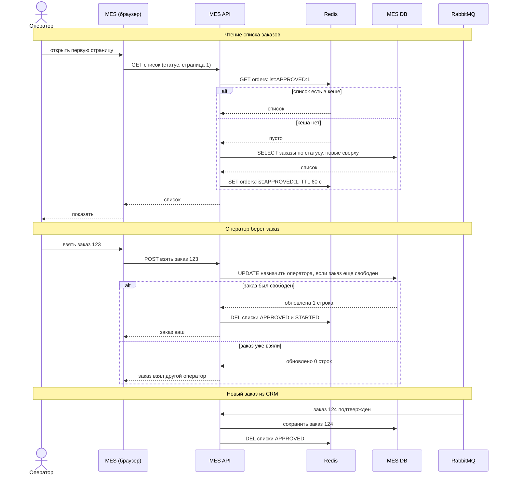

# Диаграмма последовательности: список заказов MES с кешем

Чтение списка (Cache-Aside), оператор берет заказ, новый заказ из CRM

```mermaid
sequenceDiagram
    actor Op as Оператор
    participant UI as MES (браузер)
    participant API as MES API
    participant Cache as Redis
    participant DB as MES DB
    participant MQ as RabbitMQ

    Note over Op,MQ: Чтение списка заказов
    Op->>UI: открыть первую страницу
    UI->>API: GET список (статус, страница 1)
    API->>Cache: GET orders:list:APPROVED:1
    alt список есть в кеше
        Cache-->>API: список
    else кеша нет
        Cache-->>API: пусто
        API->>DB: SELECT заказы по статусу, новые сверху
        DB-->>API: список
        API->>Cache: SET orders:list:APPROVED:1, TTL 60 с
    end
    API-->>UI: список
    UI-->>Op: показать

    Note over Op,MQ: Оператор берет заказ
    Op->>UI: взять заказ 123
    UI->>API: POST взять заказ 123
    API->>DB: UPDATE назначить оператора, если заказ еще свободен
    alt заказ был свободен
        DB-->>API: обновлена 1 строка
        API->>Cache: DEL списки APPROVED и STARTED
        API-->>UI: заказ ваш
    else заказ уже взяли
        DB-->>API: обновлено 0 строк
        API-->>UI: заказ взял другой оператор
    end

    Note over Op,MQ: Новый заказ из CRM
    MQ->>API: заказ 124 подтвержден
    API->>DB: сохранить заказ 124
    API->>Cache: DEL списки APPROVED
```
